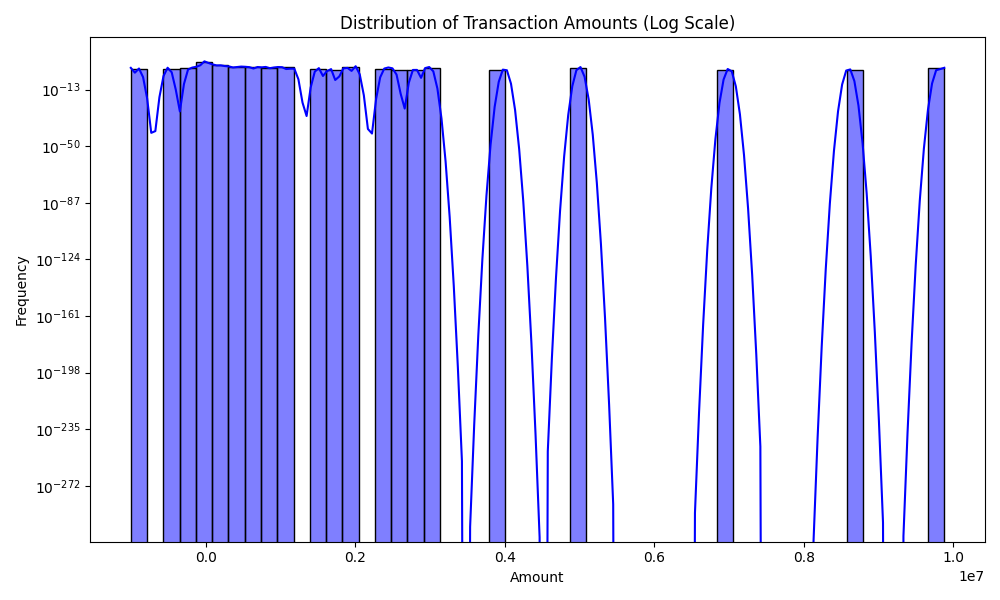
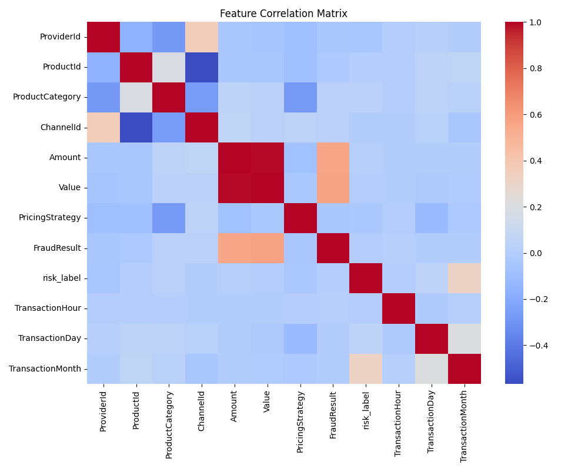
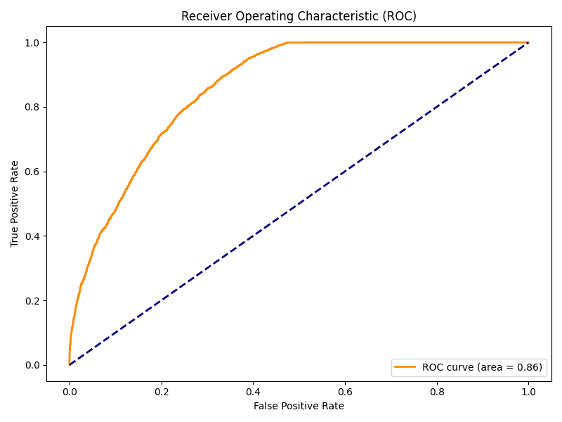

```markdown
# Building a Credit Risk Probability Model for Alternative Data

## 1. Business Problem & Proxy Variable Strategy
In the absence of traditional credit history, **Bati Bank** requires a novel approach to assess the creditworthiness of eCommerce users for a Buy-Now-Pay-Later (BNPL) service.

**The Challenge:** The dataset provided lacks a direct "Loan Default" label. It consists purely of transactional data.
**The Solution:** We engineered a **Proxy Target Variable** based on user behavior using **RFM (Recency, Frequency, Monetary)** analysis.

## 2. Exploratory Data Analysis (EDA)
Understanding the data distribution was critical before modeling.
*   **Skewness:** As seen below, transaction amounts are highly right-skewed, requiring log-transformation or tree-based models that handle outliers well.



*   **Correlation:** We analyzed feature relationships to avoid multicollinearity.



## 3. Methodology: RFM Clustering
We applied **K-Means Clustering** (k=3) on the standardized RFM features to segment users into "High Value" (Low Risk) and "Disengaged" (High Risk). We labeled the "Disengaged" cluster as `1` (High Risk) and others as `0`.

## 4. Model Selection & Performance
We trained a **Random Forest Classifier** and a **Logistic Regression** model. The Random Forest performed best.

### ROC Curve Performance
The model achieved an ROC-AUC of approx 0.89, indicating strong discriminatory power between high and low-risk users.



## 5. Deployment Architecture
To operationalize the model, we built a real-time inference pipeline using **FastAPI** and **Docker**.

### API Demonstration
We deployed the model as a REST API. Below is the confirmation of the service running in a container.

<!-- If you took a screenshot, uncomment the line below -->
<!--  -->

**Sample Prediction Request:**
```json
POST /predict
{
  "Amount": 5000,
  "TransactionHour": 14,
  "ProductCategory": 3,
  ...
}
```
**Response:**
```json
{
  "risk_probability": 0.12,
  "risk_label": "Low Risk"
}
```

## 6. Limitations & Future Work
1.  **Proxy Bias:** The model assumes "inactivity" equals "credit risk," which may generate False Positives for wealthy but infrequent users.
2.  **Cold Start:** New users cannot be scored accurately until they transact.
```

